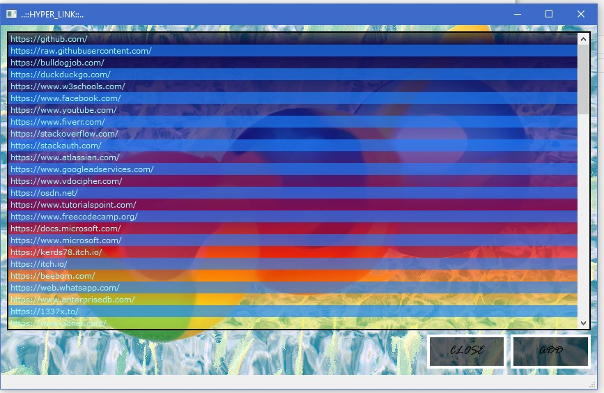

 
<h1>PyQt5_Link_Opener</h1>
<h3>One clink way to open your most visited sites in your default browser!</h3>

:::::::

 
<h1>Installation</h1>

`pip install -r requirements.txt`
    
<h1>Usage Instructions</h1>
<ul>
    <li>Shutdown your default browser completely before you perform this step</li>
    <ul>
      <li>reason->The process of the app is to open the data file of google chrome (for exmaple) and read it's history, So to do this, chrome has to be shutdown completely</li>
    </ul>
    <li>Press the Add button and wait for 2-3 seconds, after that all website domains you have visited will appear on the app window</li>
    

  </ul>
